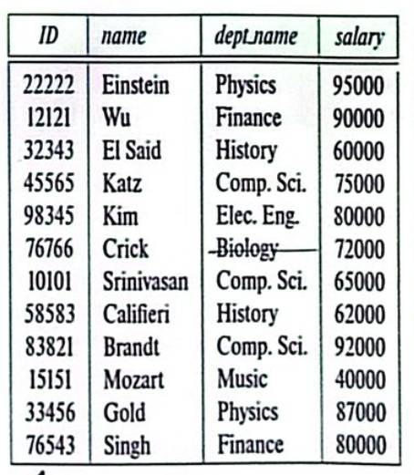
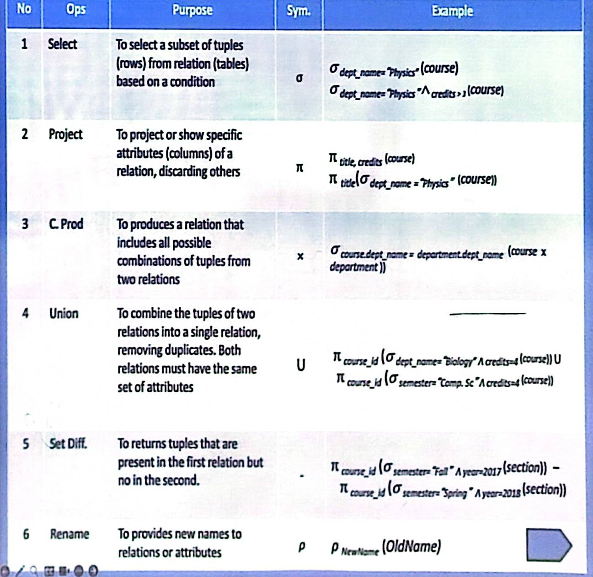
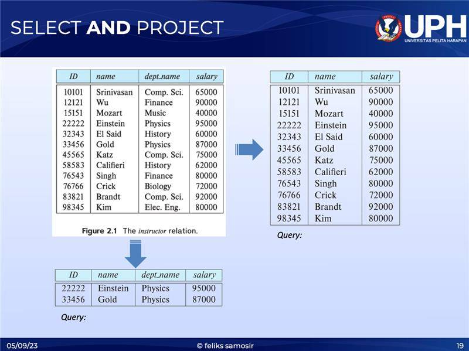
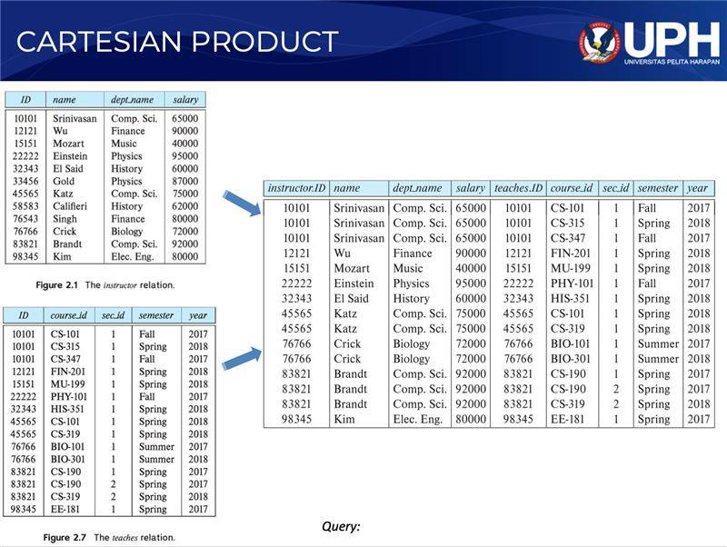
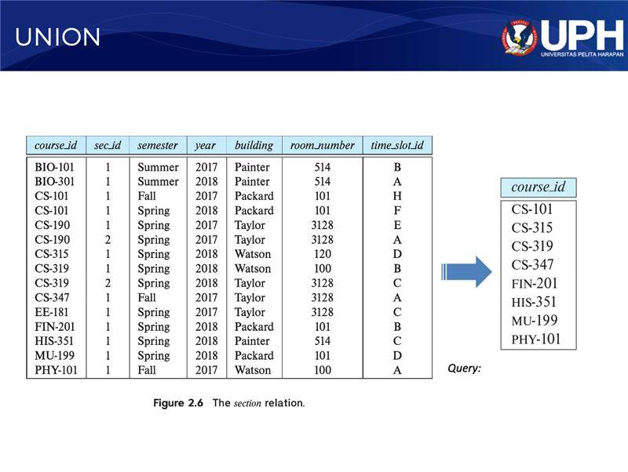

## 📘 My Personal Notes

### 🗓️ Week 2: DataBase Schema

#### 📍 Definition and Example of Database Schema
- DB Schema merupakan gambaran logic secara umum dari sebuah DataBase. Ada juga namanya DB instance yang merupakan sebuah gambar yang merepresentasikan nilai dari sebagian DataBase.
- Contoh DB Instance :\
  
- Format penulisan Schema : _namaTabel_(atribut1, atribut2, ...)

#### 📍 Keys in DataBase
- SuperKey(SK) :\ Satu set atau lebih atribut yang bisa secara unik mengidentifikasi sebuah tabel. Contohnya atribut [ID] dan [ID, name] bisa secara unik mengidentifikasikan seorang _instructor_
- Candidate Key (CK) :\ Sebagai contoh [ID] bisa menjadi CK karena bisa secara unik merepresentasikan _instructor_, tapi [ID, name] tidak bisa menjadi CK karena name tidak perlu digunakan untuk mengidentifikasi secara unik.
- Primary Key (PK) :\ Beberapa CK yang telah ada akan dipilih 1 yang akan menjadi PK yang bisa dipastikan nilainya unik dan TIDAK boleh NULL.
- Foreign Key (FK) :\ Sebuah atribut yang memiliki hubungan dengan tabel lain yang atributnya PK. Contohnya ada 2 buah tabel, Tabel_Film dan Tabel_Penayangan, Tabel_Film memiliki PK id_film dan Tabel_Penayangan memiliki atribut id_film yang merupakan FK ke Tabel_Film. 

#### 📍 Relational Algebra 
- Consists of 6 basics operations :
  1. select, project
  2. union
  3. set difference
  4. Cartesian product
  5. rename\

- Example 
\
Select : dept_name = "Physics" (Instructor)
Project : ID,name,salary (Instructor)

\
instructor x teaches

\
course_id(semester = "Fall" A year = "2017") U (semester = "Spring" A year = "2018")

