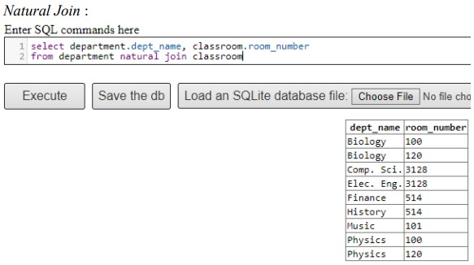
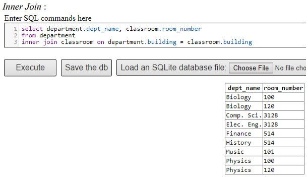
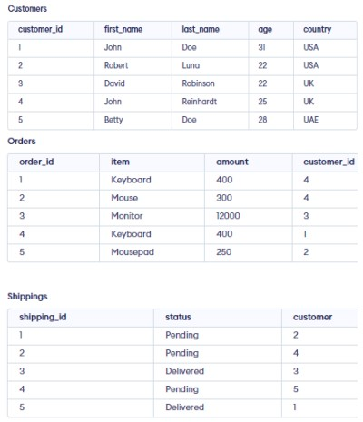
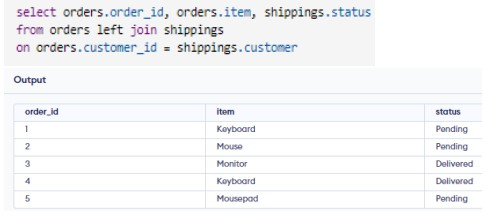
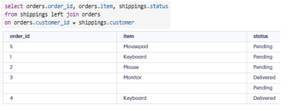
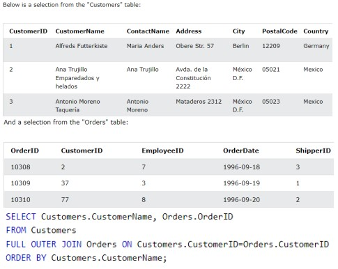
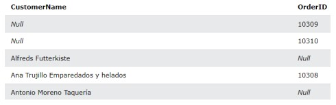

## 📘 My Personal Notes

### 🗓️ Week 5: Join Expressions

#### 📍 Perbedaan Natural Join dan Inner Join
- _Returned Records_ : Pada Natural Join, apabila tidak ada kondisi yang ditentukan, maka akan secara otomatis mencari atribut yang memiliki value yang sama di kedua tabel. Sedangkan pada Inner Join, value yang dihasilkan adalah value yang exist dan sama dalam kedua tabel sesuai dengan kondisi pengecekannya.
- _Syntax_ :
  - Natural Join = SELECT * FROM tabel1 NATURAL JOIN tabel2
  - Inner Join = SELECT * FROM tabel1 INNER JOIN tabel2 ON tabel1.Nama_Kolom = tabel2.Nama_Kolom
- _Example_ :\
  \
  

#### 📍 Left Join, Right Join, Full Join

- _Left Join_ : Teknik Left Join akan digunakan ketika kita ingin menggabungkan tabel1 dengan kolom yang cocok di tabel2. Dengan kata lain, tabel1 akan menjadi patokan dan akan memberi output yang dicocokkan dengan tabel2. Sebagai contoh dibawah, kolom order_id dan item di tabel orders akan menjadi output yang urutannya tidak berubah, kemudian untuk mendapatkan kolom status, akan di cocokan kolom customer_id di tabel orders dengan kolom customer di tabel shippings.\
  
  
- _Right Join_ : Teknik Right Join akan digunakan ketika kita ingin menggabungkan tabel2 yang valuenya di cocokan dengan kolom di tabel1. Dengan syntax ‘from orders right join shippings’ itu sama saja dengan ‘from shippings left join orders’. Dengan contoh dibawah ini, dikarenakan pada situs programmiz online compiler tidak menyediakan fitur Right Join maka kita bisa menggunakan alternatif Left Join. hasilnya tentu saja berbeda dengan hasil left join yang ada diatas, karena kali ini yang menjadi patokan adalah tabel shippings sehingga urutan pada kolom status tidak akan berubah. Bagian yang kosong dikarenakan pada tabel shippings terpadat customer_id = 5 sedangkan pada tabel orders tidak ada data mengenai customer_id yang bernilai 5.
  
  
- _Full Join_ : Teknik Full Join akan digunakan untuk menggabungkan semua baris di kolom yang telah dipilih dengan SELECT yang kemudian akan di cek kondisinya dengan ON. Dalam contoh di bawah, kolom CustomerName pada tabel Customers memiliki 3 baris yang akan digabungkan dengan semua baris yang ada pada kolom OrderID di tabel Orders. OrderID = 10309 dengan CustomerID = 37 tidak ada yang cocok dengan CustomerID di tabel Customers sehingga outputnya akan NULL di kolom CustomerName. Begitu juga sebaliknya dengan CustomerName = ‘Alfreds Futterkiste’ CustomerID = 1 di tabel Customers tidak ada yang cocok dengan CustomerID di tabel Orders sehingga outputnya akan NULL di kolom OrderID.\
  \
  

#### 📍 DB Languages, Design, Architecture, and Users and Administrator
- _Poin-poin Utama_
- _Contoh/Use-Case_
- _Catatan Tambahan_

... (dan seterusnya untuk sub-topik lainnya di Minggu 1)

---

(_Template di atas dapat diulangi untuk minggu-minggu berikutnya dengan topik dan sub-topik yang relevan._)

---
